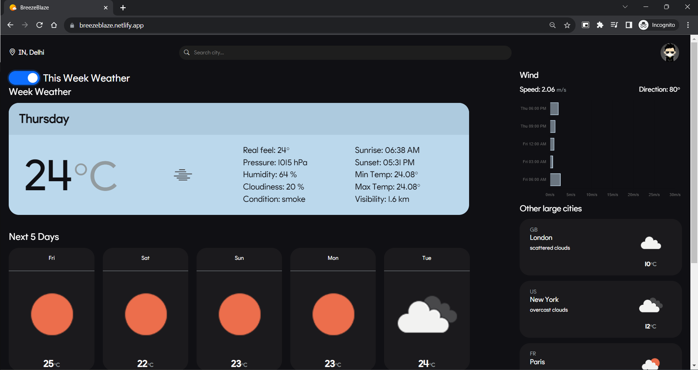
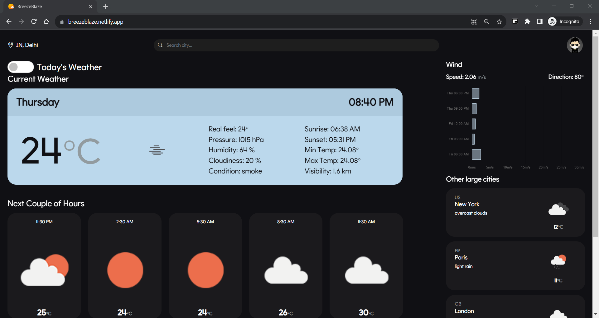
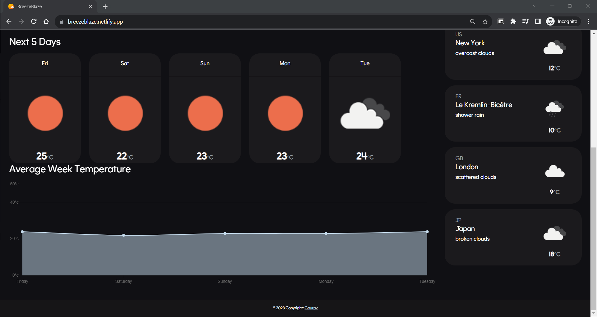
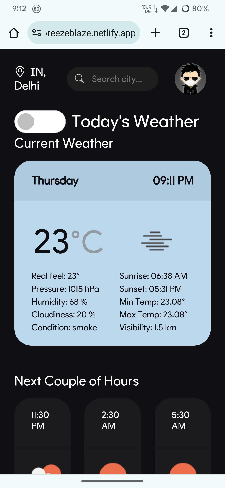
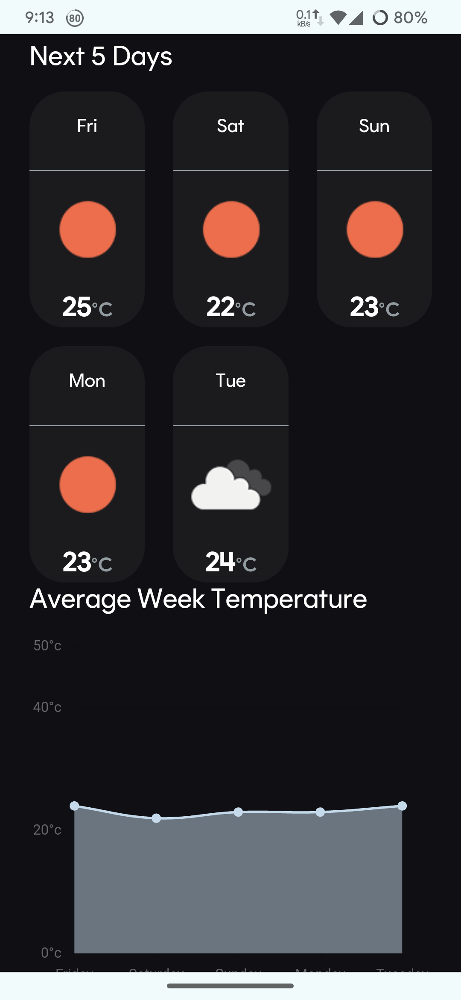
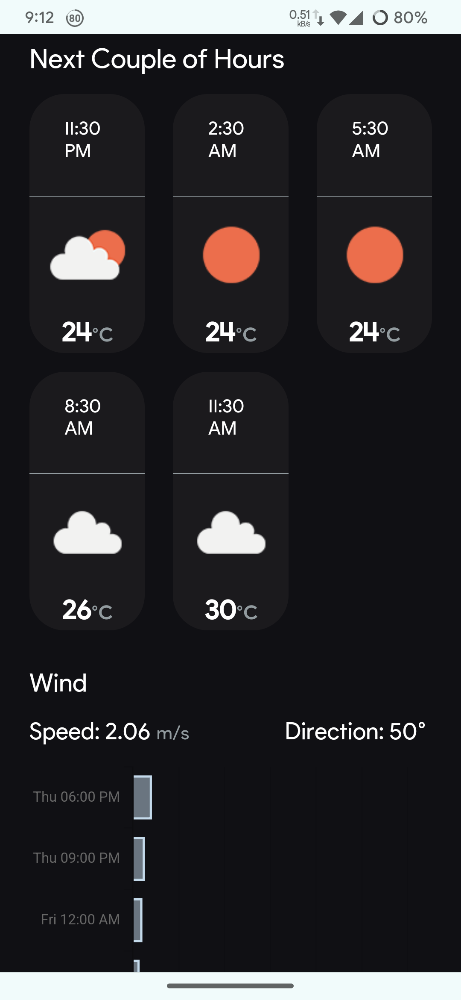

# BreezeBlaze-Weather App

BreezeBlaze is a user-friendly weather application developed using Vue.js. It allows users to easily check the current weather and forecasts for today and the upcoming week. The app utilizes the OpenWeatherMap API for weather data and the OpenCage API for geolocation services.

## Deployed Website

You can access the deployed BreezeBlaze website at [breezeblaze.netlify.app](https://breezeblaze.netlify.app/).

## Screenshots

### Desktop UI







### Mobile UI

| Mobile UI - 1                              | Mobile UI - 2                                   | Mobile UI - 3                                |
|:------------------------------------------:|:-----------------------------------------------:|:--------------------------------------------:|
|  |  |    |

## Features

### Today's Weather
1. **Current Weather:**
   - Real Feel
   - Pressure
   - Humidity
   - Cloudiness
   - Condition
   - Sunrise
   - Sunset
   - Min Temp
   - Max Temp
   - Visibility

2. **Next Couple of Hours:**
   - 3-hour interval forecast for the next few hours.

### This Week's Weather
1. **Next 5 Days:**
   - Detailed weather forecast for the next 5 days.

2. **Average Week Temperature Graph:**
   - Graphical representation of the average weekly temperature.

### Additional Information
- **Static Side Panel:**
  1. **Wind Information:**
     - Wind Speed
     - Wind Direction
     - Wind Speed Graph (3-hour time interval)
  2. **Other Large Cities:**
     - Quick tiles displaying weather information for 4 large cities.

- **Header with Search Panel:**
  - Weather search functionality allowing users to search for weather information for specific locations.

## Technologies Used

- **Vue.js:** Frontend framework for building user interfaces.
- **OpenWeatherMap API:** Provides weather data for the app.
- **OpenCage API:** Offers geolocation services for location-based data.

## Installation

Follow these steps to set up the BreezeBlaze Weather App locally:

1. **Clone the Repository:**

Follow these steps to set up the BreezeBlaze Weather App locally:
```
git clone https://github.com/Gaurav241/BreezeBlaze-Weather-App.git
```

2. **Navigate to the Project Directory:**
```
cd BreezeBlaze
```
Create .env File: Create a file named .env in the project directory. Add the following content to the .env file:
or just rename .env.example to .env
```
VUE_APP_LOCATION_API_KEY=your_OpenCage_API_key_here
VUE_APP_WEATHER_API_KEY=your_OpenWeatherMap_API_key_here
```
Replace your_OpenCage_API_key_here with your OpenCage Geocoding API key and your_OpenWeatherMap_API_key_here with your OpenWeatherMap API key.

3. **Install Dependencies:**
```
npm install
```

4. **Run the App:**
```
npm run serve
```
Once you have followed these steps, the BreezeBlaze Weather App should be up and running locally on your machine. Access the app by opening a web browser and navigating to http://localhost:8080 (or another port number if specified in the console output).

## Contributions

Contributions are welcome! Please feel free to submit issues and pull requests.

## License

This project is licensed under the MIT License - see the [LICENSE](LICENSE.txt) file for details.

---

Enjoy checking the weather with BreezeBlaze! If you have any questions or suggestions, feel free to reach out. Happy coding! ☀️🌦️
